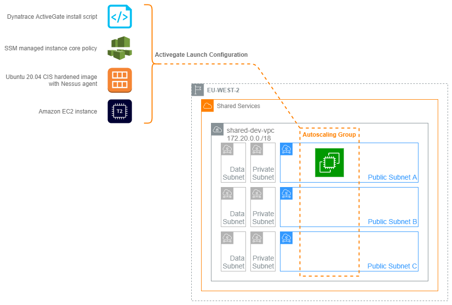

# Dynatrace Activegate



## Overview

Dynatrace is CRUK's central monitoring platform. The system employs a central cluster of servers to process data and a web of [ActiveGates](https://www.dynatrace.com/support/help/setup-and-configuration/dynatrace-activegate/basic-concepts/when-do-i-need-to-install-an-activegate/) that act like proxies, relaying data from agents back to the cluster. ActiveGates are placed in environments local to where data collection is needed. To extend Dynatrace into the new Landing Zone accounts we need to deploy new ActiveGates into the shared VPCs and ensure secure connectivity back to the cluster.

## Purpose

The purpose of this project is to automate the provision of ActiveGates as part of lifecycle management. Placing these in an autoscaling group gives us the advantage of automatic machine replacement in the case of emergencies and a platform for performing safe, controlled updates to the instances themselves.

Launching this stack into an environment will create an autoscaling group configured with an EC2 instance launch configuration. This is configured to download and install the Dynatrace Activegate server on provisioning a new instance. This in turn sets-up the instance for monitoring on a CRUK-managed, CIS hardened Ubuntu server. The instance is registered with the Dynatrace cluster and is configured as a new target for local Dynatrace agents.

## IAM Roles

The ActiveGate instance role has been updated with an inline policy to facilitate AWS API integration with Landing Zone accounts. This role uses an inline policy to allow metrics to be gathered from the account.

The Activegate is also added to SSM to provide secure SSH access to the box if needed by adding the AWS managed policy `AmazonSSMManagedInstanceCore`.

### Adding new accounts to monitor through AWS API integration

To gather AWS metrics from Landing Zone accounts we need the ActiveGate to be able to assume a role in the target LZ account. This external role allows Dynatrace read-only access to services we wish to monitor and is secured with the condition that both roles have identical External IDs generated by the Dynatrace cluster.

The target account will need a new role called `DynatraceIntegrationRole` deployed to it. We do this via the Landing Zone Account Vending Machine using the `aws-landing-zone-dynatrace-integration.template`. THsi template includes the role, the iam policy and the trust policy. In turn, the Dynatrace Activegate's role policy `dynatrace_aws_monitoring_role` will need to be updated with the ARN of the role we have deployed into the target LZ accounts. (This takes the form `arn:aws:iam::<account number>:role/dynatrace-integration-role`).

Once the `DynatraceActivegatePolicy` has been updated with the ARNs of the external accounts we will need to configure the API integration in the Dynatrace console. (This is a manual process - notes on configuring Dynatrace Managed to be added here)

## Deploying the ActiveGate stack

### Setting Application Parameters

A small set of parameters will need to be updated to launch this stack in to fresh environments:

**`bin/dynatrace-activegate.ts`**

Parameter                         | Description
:----                             | :----
`account`                         | Explicitly set per environment
`region`                          | Explicitly set per environment

**`lib/dynatrace_activegate_stack.ts`**

Parameter                         | Description
:----                             | :----
`vpc_id`                          | Explicitly set per environment
`cdk.Tags.of(this).add`           | The CRUK tagging defaults are applied to every object in the stack
`sg_activegate.add_ingress_rule`  | Security Groups must allow traffic on port 443 and 9999

**`lib\user-data.sh`**
Parameter                         | Description
:----                             | :----
`SVCENDPOINT`                     | A Privatelink service endpoint DNS address

### Launch the stack in the Shared Services account

Currently the `dynatrace-activegate` stack is deployed from a laptop; a deployment pipeline is planned in the very near future. The TransitVPC script creates two stacks; one in each region that the VPC peering has to bridge. Deploy these with

```bash
cdk deploy (--profile <profilename> / env. credentials) --all
```
