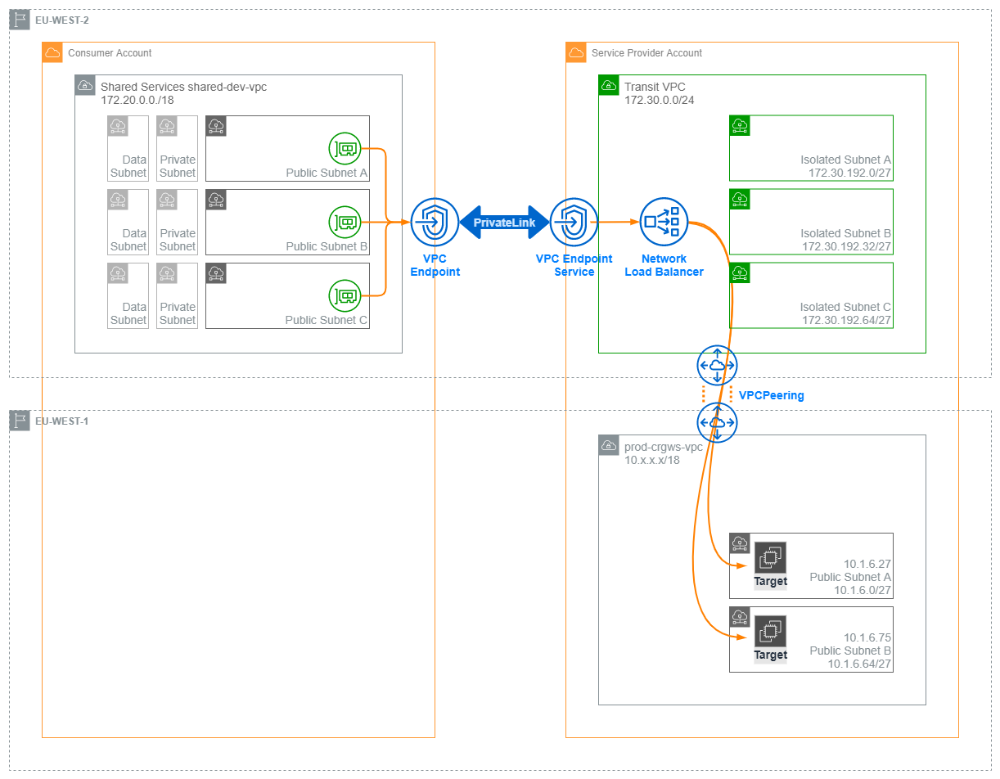

# Dynatrace Transit VPC



## Overview

A temporary solution is needed to provide connectivity between the new AWS accounts in Landing Zone and legacy AWS accounts currently in production. This stack in conjunction with the dynatrace-endpoint stack builds a transit VPC between the two accounts and routes traffic between them over an AWS PrivateLink connection. This has a number of advantages:

* Provides a private and secure network connection between connected VPCs
* Is able to overcome private IP address range overlaps
* Can be tailored for other applications and services
* Can route traffic across region boundaries account boundaries

## Purpose

This stack will allow us to publish the Dynatrace service over AWS [PrivateLink](https://aws.amazon.com/privatelink/) in remote VPCs. Traffic from the Dyantrace clients (referred to as _consumers_ of the Dynatrace service) is then able to be routed over this connection and back to the Dynatrace cluster. By using an intermediary VPC this service can now reach across account and region boundaries, extending a VPC's private network connectivity to other accounts and VPCs over the AWS PrivateLink network.

Clients in consumer VPCs will be able to connect to their respective servers on what appears to them as a local network. Examples of services that can be extended to other networks include Dynatrace, a monitoring and alerting system, and Nessus which is a security and compliance service.

It does this in three parts:

1. Creates a new VPC and peers it with the Dynatrace service VPC
2. Adds a network load balancer to the new VPC with the Dyantrace Cluster ActiveGates configured in the target group
3. Creates a Service Endpoint in front of the NLB that approved accounts may connect to

A second stack `dynatrace-endpoint-service` is needed to terminate the service in the service consumer account. In turn it will

1. Creates a security group for the endpoint to allow traffic from the consumer vpc
2. Adds the VPC endpoints to each availability zone
3. Takes the Service Service name and builds a set of internal Route53 records pointing the Dynatrace service to the VPC endpoints

Traffic bound for the Dynatrace service can now be directed at the service endpoint by DNS. This load-balances the requests from the consumer account across the VPC endpoints and then forwards traffic across a PrivateLink connection, over the NLB and VPC peer and on to the Dynatrace nodes.

## Deploying the transit VPC stack

Setting-up a new Dynatrace transit VPC requires two Stages:

1. Create a service endpoint in the service provider VPC
2. Create a VPC endpoint in the consumer VPC and connect to the endpoint service

## Useful commands

* `npm run build`   compile typescript to js
* `npm run watch`   watch for changes and compile
* `npm run test`    perform the jest unit tests
* `cdk deploy`      deploy this stack to your default AWS account/region
* `cdk diff`        compare deployed stack with current state
* `cdk synth`       emits the synthesized CloudFormation template

### Prerequisites

You will need access to an IAM role with sufficient permissions to create all resources in each of the accounts.

### 1. Create a Dynatrace Service Endpoint

Using the [TransitVPC stack](/docs/privatelink-transit-vpc.md), create an endpoint service that the consumer account can connect to. The following parameters were used to customise the stack to publish the Dynatrace service internally.

This stack has been lunched into the AWS_Pod account (614844069056) with the following parameters needed to forward Dynatrace traffic.

#### Transit VPC Parameters

**`./app.py`**

Parameter                     | Description
 :----                        | :----
**`TargetVpcStack`**          | The `account` and `region` of the VPC hosting the service we want to connect to
**`TransitVpcStack`**         | The `account` and `region` of the transit VPC

**`dynatrace_transit_vpc/transit_vpc_stack.py`**

Parameter                     | Description
 :----                        | :----
**`servicename`**             | This is a short and unique name used to identify the service and objects created
**`allowed_principles`**      | ARN of consumer account ( Eg. "arn:aws:iam::701500798470:root")
**`transit_vpc_cidr`**        | This is a small (24bit), non-overlapping subnet taken from the end of `172.16.0.0/16`
**`elbv2_targets.IpTarget`**  | The `ip_address` and `availability_zone` of each instance Dynatrace Cluster ActiveGate
**`listeners`**               | One listener will need to be created for each port that requires forwarding over the transit VPC

**`dynatrace_transit_vpc/target_vpc_stack.py`**

Parameter                     | Description
 :----                        | :----
**`target_vpc_id`**           | ID of the VPC containing the service we want to connect to

Launch the stack in the provider account.

Currently the TransitVPC is deployed from a laptop; a deployment pipeline is planned in the very near future. The TransitVPC script creates two stacks; one in each region that the VPC peering has to bridge. Deploy these with

```bash
cdk deploy (--profile <profilename> / env. credentials) --all
```

* Check the peering connection between VPCs is Active in both regions.
* This may need to be accepted by the service VPC

* Check security groups for the service provider infrastructure
* Should allow traffic on all configured ports and protocols
* Should allow traffic from the transit vpc CIDR range (`transit_vpc_cidr`)

* Add routes to the target vpc hosting the service:

Destination         | Target                    | Status
 :----              | :----                     | :----
`transit_vpc_cidr`  | New peering connection ID | Active

**Note:**
This could be automated but extreme care must be taken to not disrupt production services

A VPC peering connection will be created between the transit VPC and the provider VPC. This will need to be accepted by the provider VPC to allow traffic to traverse over the peer.

Take a note of the output of this stack; the *Service Name* is will be needed to set up the service connection in the consumer vpc.

### 2. Deploy the Dynatrace Endpoint Service stack in the consumer VPC

In Landing Zone all VPC-related resources are shared from the Networking Account, so that's where we need to configure the PrivateLink connection. As the VPC is shared, resources in the network account are available to other accounts that the VPC is shared with.

The endpoint service is dependant on the `dynatrace-transit` stack for the service name. This is configured as an output from the transit stack and will look similar to `com.amazonaws.vpce.eu-west-2.vpce-svc-025328360521f0768`.

#### Endpoint Service Parameters

The Dynatrace endpoint service was configured using the following parameters:

#### `./script.py`

Parameter                     | Description
 :----                        | :----
**`endpoint_service_name`**   | the Service Endpoint Name outputted by the `dynatrace-transit` stack
**`peer`**                    | CIDR range allowing traffic from the service consumer VPC
**`connection`**              | The service port used by Dynatrace

Launch the Endpoint Service stack into the consumer account. (In our case, the shared VPC in the Networking account). The stack will create local Route53 DNS records pointed at the VPC endpoints and will output the DNS name for the newly-published Dyantrace service. It will take the form:

```yaml
vpce-04f3094497ceabca1-q634a777.vpce-svc-0c7c07b604c6f4254.eu-west-2.vpce.amazonaws.com
```

We can test if the connection is successful by performing a DNS query on the endpoint from the consumer VPC.

```bash
ubuntu@ip-172-20-18-64:~$ dig vpce-04f3094497ceabca1-q634a777.vpce-svc-0c7c07b60
4c6f4254.eu-west-2.vpce.amazonaws.com

DiG 9.16.1-Ubuntu <<>> vpce-04f3094497ceabca1-q634a777.vpce-svc-0c7c07b604c6f4254.eu-west-2.vpce.amazonaws.com
;; global options: +cmd
;; Got answer:
;; ->>HEADER<<- opcode: QUERY, status: NOERROR, id: 22195
;; flags: qr rd ra; QUERY: 1, ANSWER: 3, AUTHORITY: 0, ADDITIONAL: 1
;; OPT PSEUDOSECTION:
; EDNS: version: 0, flags:; udp: 65494
;; QUESTION SECTION:
;vpce-04f3094497ceabca1-q634a777.vpce-svc-0c7c07b604c6f4254.eu-west-2.vpce.amazonaws.com. IN A
;; ANSWER SECTION:
vpce-04f3094497ceabca1-q634a777.vpce-svc-0c7c07b604c6f4254.eu-west-2.vpce.amazonaws.com. 60 IN A 172.20.13.41  <-- !
vpce-04f3094497ceabca1-q634a777.vpce-svc-0c7c07b604c6f4254.eu-west-2.vpce.amazonaws.com. 60 IN A 172.20.61.75  <-- !
vpce-04f3094497ceabca1-q634a777.vpce-svc-0c7c07b604c6f4254.eu-west-2.vpce.amazonaws.com. 60 IN A 172.20.5.232  <-- !
;; Query time: 3 msec
;; SERVER: 127.0.0.53#53(127.0.0.53)
;; WHEN: Tue May 25 07:24:43 UTC 2021
;; MSG SIZE  rcvd: 164
```
